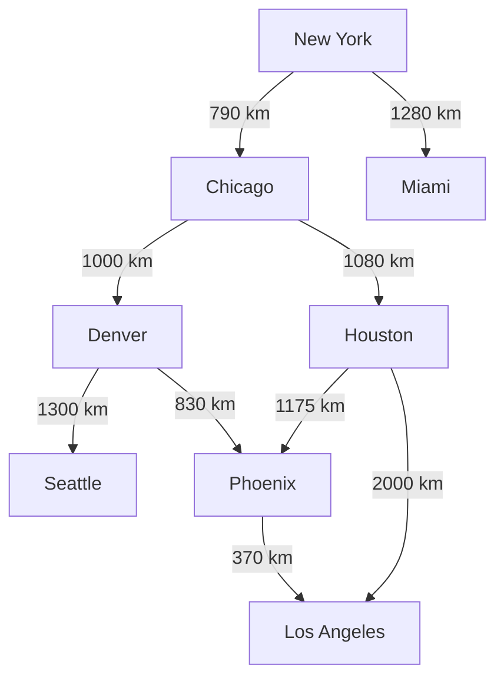
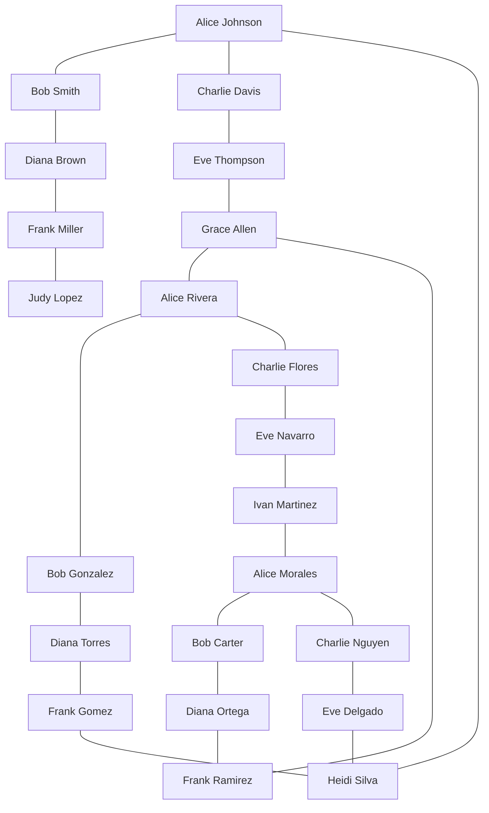

## GPSSystem Graph



## SearchEngine Data

```json
{
  "documents": [
    
    "It was the best of times, it was the worst of times, it was the age of wisdom, it was the age of foolishness, it was the epoch of belief, it was the epoch of incredulity, it was the season of Light, it was the season of Darkness, it was the spring of hope, it was the winter of despair.",

    "Call me Ishmael. Some years ago—never mind how long precisely—having little or no money in my purse, and nothing particular to interest me on shore, I thought I would sail about a little and see the watery part of the world. It is a way I have of driving off the spleen and regulating the circulation.",

    "In a hole in the ground there lived a hobbit. Not a nasty, dirty, wet hole, but a hobbit-hole, and that means comfort. This hobbit was a very well-to-do hobbit, and his name was Bilbo Baggins. The Hobbit was a story of adventures and unexpected journeys.",

    "The quick brown fox jumps over the lazy dog. This pangram contains every letter of the English alphabet. It is often used to test typing skills or display fonts. Practicing this sentence can improve speed and accuracy in typing.",

    "Pattern recognition is essential in computer science and artificial intelligence. Detecting a pattern quickly can lead to optimized algorithms and efficient problem solving. Machine learning models rely heavily on finding patterns within large datasets.",

    "The pattern in the data was difficult to find, but with persistence and advanced analysis, the pattern emerged clearly. Understanding this pattern allowed researchers to predict future outcomes with high accuracy.",

    "This text contains the phrase many times: Not all those who wander are lost. Not all those who wander are lost. Not all those who wander are lost. Not all those who wander are lost. Not all those who wander are lost.",

    "Another large text filled with words and the phrase occurring intermittently among them. Not all those who wander are lost here and there, it shows up frequently, but sometimes it hides. Searching for the phrase can be a challenging task in this large body of text.",

    "A very large document with the phrase repeated many times to make the search algorithm work harder. Not all those who wander are lost. Not all those who wander are lost. Not all those who wander are lost. Not all those who wander are lost."
  ],
  
  "pattern": "Not all those who wander are lost"
}
```

## Network

