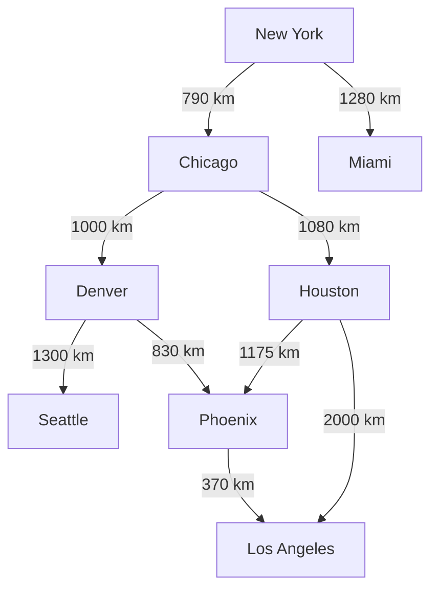

## GPSSystem Graph

```mermaid
graph TD
    NY["New York"] -->|790 km| CHI["Chicago"]
    NY -->|1280 km| MIA["Miami"]
    CHI -->|1000 km| DEN["Denver"]
    CHI -->|1080 km| HOU["Houston"]
    DEN -->|1300 km| SEA["Seattle"]
    DEN -->|830 km| PHX["Phoenix"]
    HOU -->|1175 km| PHX
    HOU -->|2000 km| LA["Los Angeles"]
    PHX -->|370 km| LA
```